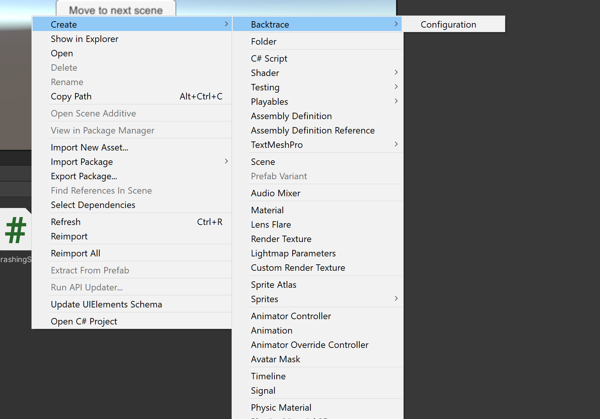
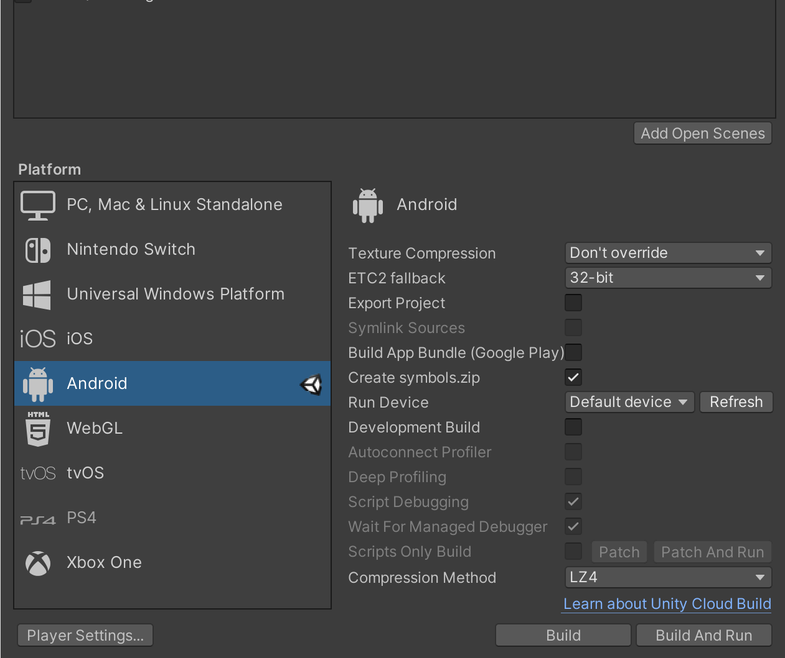
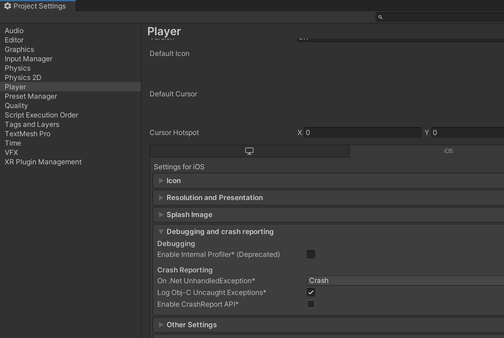
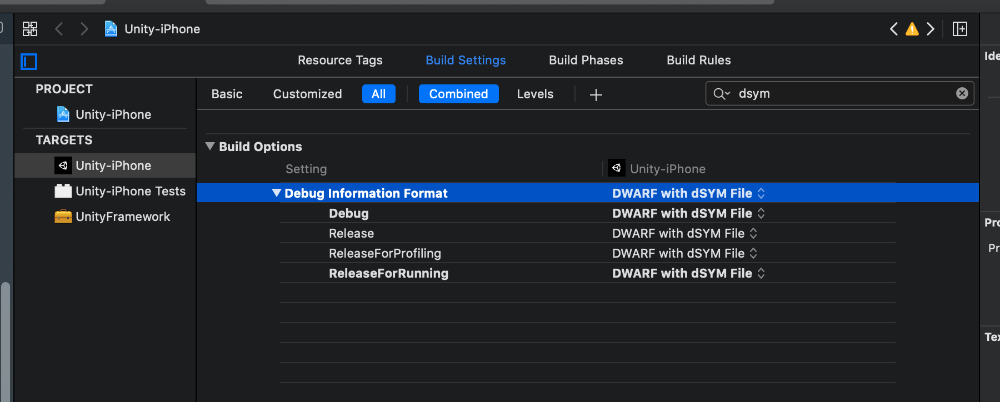
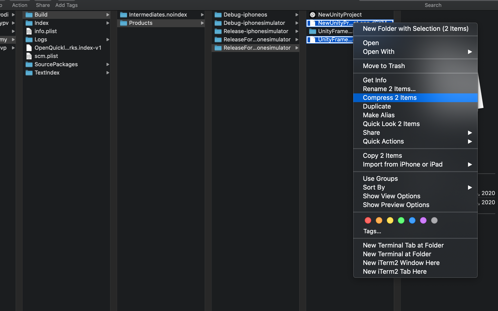
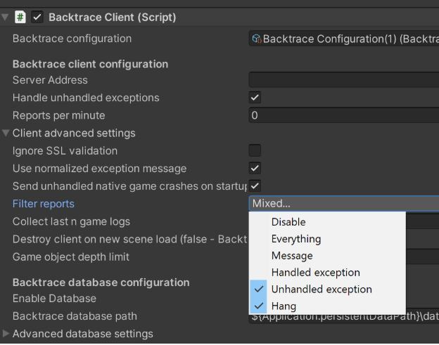

# Backtrace による Unity のサポート

[Backtrace](http://backtrace.io/) を Unity に統合すると、ログエラー、Unity のハンドル済みおよび未ハンドルの例外、ネイティブクラッシュをキャプチャして、Backtrace インスタンスにレポートできます。これにより、開発者はすぐに、ソフトウェアのエラーに優先順位を付けてデバッグできるようになります。

https://backtrace.io/create-unity ですぐに Backtrace インスタンスを作成して、このライブラリを自作のゲームに統合できます。

[](https://openupm.com/packages/io.backtrace.unity/)

[github release]: (https://github.com/backtrace-labs/backtrace-labs/)

- [機能の概要](#features-summary)
- [前提条件](#prerequisites)
- [サポートされているプラットフォーム](#platforms-supported)
- [セットアップ](#installation)
- [プラグインのベストプラクティス](#plugin-best-practices)
- [Android 固有の情報](#android-specific-information)
- [iOS 固有の情報](#ios-specific-information)
- [データプライバシー](#data-privacy)
- [API の概要](#api-overview)
- [アーキテクチャの説明](#architecture-description)
- [Backtrace でのエラーの調査](#investigating-an-error-in-backtrace)

## 使用法

```csharp

 //マネージャー BacktraceClient インスタンスから読み取り
 var backtraceClient = GameObject.Find("_Manager").GetComponent<BacktraceClient>();
 try
 {
     //ここで例外をスロー
 }
 catch(Exception exception)
 {
     var report = new BacktraceReport(exception);
     backtraceClient.Send(report);
 }
```

# 機能の概要 <a name="features-summary"></a>

- ログエラー、ハンドル済みおよび未ハンドルの例外、ネイティブクラッシュを Backtrace にすぐに送信する軽量なライブラリ。
  - 幅広い Unity バージョン（2017.4+）とデプロイ（iOS、Android、Windows、Mac、WebGL、PS4/5、Xbox One/S/X、Nintendo Switch、Stadia）をサポート
  - [OpenUPM](https://openupm.com/packages/io.backtrace.unity/) および Unity パッケージマネージャーを使用してインストール
- 詳細なコンテキストの収集
  - コールスタック（可能な場合は関数名や行番号を含む）
  - デバイス GUID、OS バージョン、メモリ使用量、プロセスの経過時間などのシステムメタデータ
  - アプリのバージョン、シーン情報、デバイスドライバなどのカスタムメタデータ
  - 最後の # ログ行、スクリーンショット、ログファイルまたは設定ファイル、その他のアタッチメント
  - Android NDK のクラッシュ、iOS のネイティブクラッシュ、Windows のネイティブクラッシュ
- クライアントサイド機能
  - 重複排除オプションとカスタムのクライアントサイドフィンガープリント
  - クライアントサイドのフィルターとサンプリングコントロール
  - 将来の収集に向けたオフラインでのクラッシュのキャプチャ/保存
  - カスタマイズ可能なイベントハンドラーと基本クラス
  - タイミングの観測を目的としたパフォーマンス統計の収集オプション
- 自作のゲームでの Backtrace 動作を設定できる Unity IDE インテグレーション

# 前提条件

- Unity 環境 2017.4.x
- .NET 2.0/3.5/4.5/Standard 2.0 スクリプティングランタイムバージョン
- Mono または IL2CPP スクリプティングバックエンド
- Backtrace インスタンス - https://backtrace.io/create-unity で自分のインスタンスを作成

# サポートされているプラットフォーム

backtrace-unity は、モバイル（Android、iOS）、PC（Windows、Mac）、ウェブ（WebGL）、ゲームコンソール（PlayStation4、Xbox One、Nintendo Switch）の各プラットフォームで展開されたゲームについて検証され、証明されています。プラットフォームによって、backtrace-unity で提供される機能には一部違いがあります。主要な機能をまとめると、次のようになります。

- すべてのプラットフォーム - エラー、未ハンドルの例外、ハンドル済みの例外、インデックス可能なカスタムメタデータ、ファイル添付*、最後の N ログ行、スクリーンショットの自動添付、クライアントサイドの重複排除ルール*、クライアントサイドの送信フィルタリング、クライアントサイドの送信制限、パフォーマンス診断、オフラインデータベース\*（Nintendo Switch を除く）
- Android - 属性 `uname.sysname` = Android で確認。ANR（ハング）、ネイティブなプロセス情報とメモリ情報、Java 例外ハンドラー（プラグイン、Android Studio でエクスポートされたゲーム）、NDK のクラッシュ、低メモリの警告。
- iOS - 属性 `uname.sysname` = IOS で確認。ANR（ハング）、ネイティブなエンジン、メモリ、プラグインのクラッシュ
- WebGL - 属性 `uname.sysname` = WebGL で確認。属性 device.model は現在、ブラウザー情報を共有するために使用されます。WebGL エラーのスタックトレースが利用できるのは、「Publishing Settings」/「Enable Exceptions」ドロップダウンでそれらを有効にしている場合のみであることに注意してください。詳細情報は[こちら](https://docs.unity3d.com/Manual/webgl-building.html)
- Switch - 属性 `uname.sysname` = Switch で確認。属性 GUID は Switch の再起動のたびに再生される点に注意してください（これは、ユーザーまたはデバイスの数を正確にカウントしたものではなく、Switch セッションの数です）。また、現在のリリースではオフラインデータベースとその関連機能はサポートされていないことに注意してください。
- PlayStation4 - 属性 `uname.sysname` = PS4 で確認
- Windows - 属性 `uname.sysname` = Windows で確認。エンジンクラッシュのミニダンプをキャプチャするオプションが利用できます。
- MacOS - 属性 `uname.sysname` = MacOS で確認。

ノート：Unity ではプレイヤープロパティーでスタックトレース情報を無効にできます。これが設定されていると、Backtrace のコールスタックとログ行のセクションが空になります。

# セットアップ <a name="installation"></a>

Backtrace と Unity の完全なインテグレーションをセットアップするために必要な手順のリスト。

## インストールガイド

3 つのオプションがありますが、ほとんどのユーザーには OpenUPM を使用する方法が推奨されます。

### OpenUPM

- OpenUPM の[パッケージ](https://openupm.com/packages/io.backtrace.unity/)とインストール説明書をご覧ください。

### Git URL

Unity 2018.3 から、Unity パッケージマネージャーでは [Git](https://docs.unity3d.com/Manual/upm-ui-giturl.html) を使用してパッケージを直接インストールできます。Unity リポジトリのメインページでクローン URL を使用できます。

### 手動ダウンロード

- backtrace-unity の zip ファイルをダウンロードします。それを解凍し、フォルダーを既知の場所に維持します。zip ファイルは[こちら](https://github.com/backtrace-labs/backtrace-unity/releases)でダウンロードできます
- Unity プロジェクトを開きます
- Unity パッケージマネージャーを使用して backtrace-unity ライブラリをインストールします（「Window」 -> 「Package Manager」 -> 「Add Package From Disk」 -> `KnownFolder/package.json`）

## プロジェクトへの統合

- 「Assets」メニューの「Create」オプションに、「Backtrace」 -> 「Configuration」オプションがあります。このオプションを選択します（または、空のスペースを右クリックして、メニューボックスから選択します）。そうすると、Assets フォルダーに Backtrace 設定が生成されます。生成されたアセットファイルを Backtrace クライアント設定ウィンドウにドラッグアンドドロップできます。
  
- 次に、シーンのヒエラルキーから、Backtrace レポートクライアントを関連付けるオブジェクトを選択します。次の例では、マネージャーオブジェクトを使用しています。「Inspector」パネルを使用して、「Add Component」ボタンをクリックし、Backtrace クライアントオブジェクトを検索します。
- 「Backtrace Client」パネル内に、「Backtrace Configuration」フィールドがあります。そのフィールドに、Assets フォルダーから Backtrace 設定をドラッグアンドドロップします。Backtrace クライアントとオフラインデータベースのオプションを設定するための入力を行う追加のフィールドが表示されます。
  
- 有効な Backtrace クライアント設定を指定し、ライブラリの使用を開始します。
  

## コードを通じたプロジェクトへの統合

インテグレーションパスの 1 つでは、ゲームシーン内にゲームオブジェクトを作成する必要があります。Backtrace のインテグレーションをプログラムで初期化する場合は、`BacktraceClient` クラスで利用できる `Initialize` メソッドを使用することをお勧めします。

```csharp
  var backtraceClient = BacktraceClient.Initialize(
        url: serverUrl,
        databasePath: "${Application.persistentDataPath}/sample/backtrace/path",
        gameObjectName: "game-object-name",
        attributes: attributes);
```

より高度な設定を使用する必要がある場合は、`Initialize` メソッドで `BacktraceConfiguration` スクリプタブルオブジェクトを使用できます。

```csharp
  var configuration = ScriptableObject.CreateInstance<BacktraceConfiguration>();
    configuration.ServerUrl = serverUrl;
    configuration.Enabled = true;
    configuration.DatabasePath = "${Application.persistentDataPath}/sample/backtrace/path";
    configuration.CreateDatabase = true;
    configuration.Sampling = 0.002;
    _backtraceClient = BacktraceClient.Initialize(
        configuration,
        gameObjectName: "game-object-name",
        attributes: attributes);
```

# プラグインのベストプラクティス

このプラグインは次の 6 つの「クラス」（すなわちエラー）をレポートします。

1.ログエラー - プログラマーは [Debug.LogError](https://docs.unity3d.com/ScriptReference/Debug.LogError.html)（Debug.Log のバリアント）を使用して、エラーメッセージをコンソールに記録します。
2.未ハンドルの例外 - 未ハンドルの例外は、明示的な try/catch ステートメントの外部で発生するゲーム内の例外です。
3.ハンドル済みの例外 - 明示的に特定され、ハンドルされる例外。
4.クラッシュ - ゲームプレイの終了。ゲームはクラッシュするか再起動します。
5.ハング - ゲームが応答しない状態です。プラットフォームによっては、ユーザーに「このアプリは応答を停止しました」と表示されます。
6.メモリ不足によるクラッシュ（モバイルのみ） - メモリの圧迫によってゲームがクラッシュしました。

このプラグインでは、クライアントによってレポートされる内容を 3 つの方法でコントロールして管理できます。

- [SkipReport](#filtering-a-report) を使用すると、上記のエラーのうち特定のクラスのみについてレポートするようクライアントに指示できます。
- [ログエラーのサンプリング](#sampling-log-errors)では、デバッグログエラーをサンプリングするようクライアントに指示できます。プログラマーは、小売でのリリース時に生成されているデバッグログエラーの頻度を認識していない可能性があります。そのため、このタイプのエラーを意図的にキャプチャすることをお勧めします。
- [クライアントサイドの重複排除](#client-side-deduplication)を使用すると、コールスタック、エラーメッセージ、分類子に基づいてレポートを集約して、オフラインデータベースがフラッシュされるたびに Backtrace に 1 つのメッセージのみを送信できます。

## Backtrace クライアントとオフラインデータベースの設定

以下は、Backtrace クライアントの各フィールドに入力する際のリファレンスガイドとしてご利用ください。

- Server Address：このフィールドは、自分の Unity プロジェクトから Backtrace インスタンスに例外を送信するために必要です。自分のインスタンスのこの値を取得する方法の詳細については、Backtrace のドキュメント「送信 URL とは」と「送信トークンとは」を参照してください。ノート：backtrace-unity プラグインでは、Backtrace インスタンスへのトークンが含まれている完全な URL が必要になります。
- Reports per minute：クライアントによって 1 分ごとに送信されるレポートの数を制限します。0 に設定した場合、制限はありません。1 以上に設定した場合は、その値に達すると、次の 1 分になるまでクライアントがレポートを送信しなくなります。さらに、BacktraceClient.Send/BacktraceClient.SendAsync メソッドが false を返します。
- Destroy client on new scene load：デフォルトで Backtrace クライアントが各シーンで利用できるようになります。Backtrace インテグレーションを初期化すると、各シーンから Backtrace ゲームオブジェクトをフェッチできます。デフォルトで Backtrace と Unity のインテグレーションが各シーンで利用できるようにすることを望まない場合は、この値を true に設定してください。
- Use normalized exception message：例外にスタックトレースがない場合、正規化された例外メッセージを使用して、フィンガープリントを生成します。
- Filter reports：レポートのタイプ（メッセージ、例外、未ハンドルの例外、ハング）に基づいてレポートをフィルターするよう Backtrace プラグインを設定します。このオプションはデフォルトでは無効です（None）。
- Send unhandled native game crashes on startup：ゲームの起動時に、ゲームのネイティブクラッシュを検索して送信するよう試行します。
- Handle unhandled exceptions：トグルすることで、try/catch ブロックによってキャプチャされる未ハンドルの例外をハンドルするライブラリ設定をオンまたはオフにできます。
- Symbols upload token：Android NDK のネイティブクラッシュのデバッグに使用する Unity デバッグシンボルをアップロードする場合は、Backtrace シンボルアップロードトークンをここに入力します。このオプションは、Android ビルドでのみ利用できます。
- Log random sampling rate：DebugLog.error メッセージのランダムサンプリングメカニズムを有効にします。**デフォルトでは**、サンプリングレートは **0.01** になっていて、ランダムなサンプリングレポートのわずか **1%** が Backtrace に**送信されます**。すべての DebugLog.error メッセージを Backtrace に送信したい場合は、0.01 の値を 1 に置き換えてください。
- Game Object Depth Limit：開発者は、Backtrace レポートにおけるゲームオブジェクトの子の数をフィルターできます。
- Collect last n game logs：ゲームによって生成されたログの最後の n 個を収集します。
- Enabled performance statistics：`BacktraceClient` で実行時間を測定し、パフォーマンス情報をレポート属性として含めるようにできます。
- Ignore SSL validation：デフォルトでは、Unity によって SSL 証明書が検証されます。このオプションを使用すると、SSL 証明書の検証を避けることができます。ただし、SSL 検証を無視する必要がない場合は、このオプションを false に設定してください。
- Handle ANR (Application not responding)：このオプションを利用できるのは、Android と iOS のビルドだけです。このオプションを使用すると、モバイルプラットフォーム上のゲームで発生した ANR（Application Not Responding）イベントをキャッチしてレポートできます。詳しくは、[こちら](#anr-reporting)を参照してください。
- （早期アクセス）Send out of memory exceptions to Backtrace：このオプションを利用できるのは、Android と iOS のビルドだけです。詳しくは、[こちら](#oom-reporting)を参照してください。
- Enable Database：この設定をトグルすると、オフラインであったりネットワークを検出できなかったりしてレポートを送信できない場合にそれらを保存するオフラインデータベースが、backtrace-unity プラグインによって設定されます。トグルをオンにすると、いくつかのデータベース設定を構成できます。
- Backtrace Database path：これは、Backtrace データベースによってゲームについてのレポートが保存されるディレクトリへのパスです。
  `${Application.persistentDataPath}/backtrace/database` などの補間された文字列を使って、使用される既知のディレクトリ構造を動的に検索できます。ノート：最初の初期化時に、Backtrace データベースによってデータベースディレクトリ内の既存のファイルがすべて削除されます。
- Create database directory toggle：この設定をトグルすると、指定されたパスがない場合にライブラリによってオフラインデータベースのディレクトリが作成されます。
- Client-side deduplication：backtrace-unity プラグインでは、同じレポートを結合することができます。重複排除ルールを使用すると、backtrace-unity プラグインにレポートのマージ方法を指示できます。
- Capture native crashes：このオプションは、ゲームが Android または iOS に展開されている場合に表示されます。これを使用すると、Backtrace で、Unity エンジンまたは Unity プラグインに影響するクラッシュからネイティブスタックトレースをキャプチャしてシンボル化できます。
- Minidump type：Windows マシンで生成されたレポート内の Backtrace レポートに添付されるミニダンプの種類。
- Attach Unity Player.log：Unity プレイヤーのログファイルを Backtrace レポートに追加します。ノート：この機能は、デスクトップ（Windows/MacOS/Linux）でのみ利用できます。
- Attach screenshot：例外が発生した際にフレームのスクリーンショットを生成して添付します。
- Auto Send Mode：トグルをオンにすると、下の再試行設定に基づいて自動的にデータベースから Backtrace サーバーにレポートが送信されます。トグルをオフにすると、開発者は Flush メソッドを使用して送信と消去を試みる必要があります。この設定はオンにすることをお勧めします。
- Maximum number of records：これは、オフラインの保存内容が増加するのをコントロールするためにかけられる 2 つの制限のうちの 1 つです。ここでは、データベースに保存されるレポートの最大数を設定できます。値が 0 の場合は制限がありません。制限に達するとデータベースによって古いエントリーが削除されます。
- Maximum database size：これは、オフラインの保存内容が増加するのをコントロールするためにかけられる 2 つ目の制限です。ここでは、データベースの最大サイズを MB 単位で設定できます。値が 0 の場合、サイズは無制限です。制限に達するとデータベースによって古いエントリーが削除されます。
- Retry interval：この設定では、データベースからレコードを送信できない場合に次に再試行するまでライブラリが待機すべき秒数を特定します。
- Maximum retries：この設定では、データベースからレコードを送信できない場合にシステムが送信を中断するまでに行う再試行の最大回数を特定します。
- Retry order：この設定では、Backtrace サーバーに送信されるレコードの順番を特定します。

# Android 固有の情報

backtrace-unity ライブラリでは、基礎となる Android OS（関連するメモリとプロセス）、JNI、NDK の各レイヤーから Android NDK のクラッシュと追加の Android ネイティブ情報をキャプチャすることがサポートされています。

## プロセスとメモリに関するネイティブ情報

`system.memory` の使用量に関する情報（memfree、swapfree、vmalloc.used など）が利用できるようになりました。追加の VM 詳細情報と自発的/非自発的な ctxt スイッチが含まれます。

## ANR とハング <a name="anr-reporting"></a>

Android デプロイ用の backtrace-unity クライアントを設定する場合、プログラマーは Unity エディター内の backtrace-unity GUI で、ANR またはハングのレポートを有効/無効にするためのトグルを利用できます。ここではデフォルトの値として 5 秒が使用されます。これは将来のリリースで構成できるようになります。

これらのレポートの `error.type` は `Hang` になります。

## （早期アクセス）メモリ不足に関するレポート <a name="oom-reporting"></a>

Backtrace では、Android デバイスで実行されている Unity ゲームの低メモリ状態を検出してフラグを付けることができます。低メモリ状態が検出されると、2 つの属性が設定されます。

- `memory.warning` が `true` に設定されます。
- `memory.warning.date` が、低メモリ状態の検出時にデバイスの現地時間に設定されます。

ゲームが低メモリ状態から回復せず、なおかつオペレーティングシステムによってゲームの停止が判断されない場合は、`memory.warning` と `memory.warning.date` が設定された状態でクラッシュレポートが Backtrace に送信されます。

この機能は Backtrace 設定でオンまたはオフにトグルできます。

この機能は「早期アクセス」としてリリースされており、根本原因の解決に役立つよう、近い将来に改良される予定であることに注意してください。

## シンボルのアップロード

Unity では、開発者がゲームのルートディレクトリにある il2cpp ビルドパイプラインに `symbols.zip` という名前のシンボルアーカイブを生成できます。このアーカイブには、ゲームライブラリ用に生成されたシンボルがあります。ネイティブな例外が原因でゲームがクラッシュした場合、スタックトレースには関数名ではなくメモリアドレスのみが含まれます。`symbols.zip` アーカイブのシンボルを使用すると、Backtrace で関数アドレスをソースコード内の関数名と一致させることができます。

`symbols.zip` アーカイブを生成する場合は、以下の点を確認してください。

- il2cpp ビルドを選択した
- 「Build Settings」ウィンドウで「`Create symbols.zip`」チェックボックスをオンにした
  

Backtrace では、Unity エディターから Backtrace インスタンスに自動でシンボルをアップロードできます。Backtrace シンボルアップロードパイプラインは、il2cpp Android ゲームのビルドが成功した後、シンボルアップロードトークンが Backtrace クライアントオプションで利用できる場合にトリガーされます。ビルドが成功した後、アップロードパイプラインによってシンボルアップロードが確認されます。

Unity エディターの外部でビルドを行い、シンボルを Backtrace に手動でアップロードする必要がある場合は、Unity で生成されたシンボルの名前を、末尾が `.so` 拡張子で終わる形に変更する必要があります。デフォルトでは、.zip 内に含まれているシンボルファイルの末尾の拡張子は `.sym.so` か `.dbg.so` です。Backtrace は、もっぱら末尾の `.so` 拡張子に基づいてシンボルをファイルに一致させます。zip をアップロードする前に、すべてのファイルに単一の `.so` 拡張子が付いていることを確認してください。

これらのシンボルファイルを Backtrace に送信する方法の詳細については、「Project Settings」/「Symbols」を参照してください。送信トークンを管理したり、UI を通じてアップロードしたりできるほか、接続する外部シンボルサーバーを設定して必要なシンボルを検出することができます。https://support.backtrace.io/hc/en-us/articles/360040517071-Symbolication-Overview でシンボルに関するその他のドキュメントをご覧ください。

# iOS 固有の情報

backtrace-unity ライブラリでは、基礎となる iOS レイヤーからネイティブ iOS クラッシュと iOS のネイティブなメモリ情報およびプロセス情報をキャプチャすることがサポートされています。

## プロセスとメモリに関するネイティブ情報

システムと VM の使用量に関する情報（system.memory.free、system.memory.used、system.memory.total、system.memory.active、system.memory.inactive、 system.memory.wired など）が使用できます。

## ハング

iOS デプロイ用の backtrace-unity クライアントを設定する場合、プログラマーは Unity エディター内の backtrace-unity GUI で、ANR またはハングのレポートを有効/無効にするためのトグルを利用できます。ここではデフォルトの値として 5 秒が使用されます。これらのレポートの `error.type` は `Hang` になります。

## メモリ不足に関するレポート（早期アクセス）

iOS デバイスでは、メモリの圧迫があることをオペレーティングシステムが示した場合に、Backtrace がアプリケーション状態のスナップショットを作成して、それをモバイル端末上に保持します。オペレーティングシステムが最終的にゲームを中断させることになったら、再起動後、Backtrace では状態ファイルを調査して、メモリ圧迫が原因でゲームが終了したかどうかを推測します（アルゴリズムの詳細については、[backtrace-cocoa リポジトリ](https://github.com/backtrace-labs/backtrace-cocoa#how-does-your-out-of-memory-detection-algorithm-work-)を参照してください）。この場合、前に収集および保持されたデータに基づいてエラーが送信されます。低メモリ状態が持続する場合には最大で 2 分ごとにスナップショットが作成されます。

この機能は Backtrace 設定でオンまたはオフにトグルできます。

## ネイティブクラッシュ

Unity エディターで iOS デプロイ用の backtrace-unity クライアントを設定する場合、プログラマーはトグルを使用して「`Capture native crashes`」を有効または無効にできます。このオプションを有効にすると、backtrace-unity クライアントによって確実にクラッシュレポートが生成され、ローカルに保存されて、次回のゲーム開始時にアップロードされます。Unity のクラッシュレポーターが、Backtrace のクラッシュレポーターによる Backtrace へのクラッシュの送信を妨げる場合があります。Backtrace が確実にデータを収集して送信できるように、「Enable CrashReport API」をオフに設定してください。


## デバッグシンボルのアップロード

Xcode で iOS ゲームをビルドするとき、Backtrace でデバッグしたいビルドについて `DWARF with dSYM files` を生成するようにビルド設定を構成する必要があります（デフォルトでは、`DWARF` しか生成されない可能性があります）。次の例では、それぞれの `Target` について `Project Build Settings` で `DWARF with dSYM files` が有効になっています。


この変更を行うことで、Xcode でゲームをビルドするたびに dSYM ファイルが生成されるようになります。それらのファイルは `...\Build\Products\<the folder representing your build>` にあります。その中に、シンボル化時に使用するために .zip ファイルへと圧縮して Backtrace に送信する必要がある dSYM ファイルが配置されます。



これらのシンボルファイルを Backtrace に送信する方法の詳細については、「Project Settings」/「Symbols」を参照してください。送信トークンを管理したり、UI を通じてアップロードしたりできるほか、接続する外部シンボルサーバーを設定して必要なシンボルを検出することができます。https://support.backtrace.io/hc/en-us/articles/360040517071-Symbolication-Overview でシンボルに関するその他のドキュメントをご覧ください。

# データプライバシー

backtrace-unity では、次の方法を使用して、例外の発生時にライブラリによって収集されるデータを開発者が削除したり変更したりできます。

- BeforeSend イベント
  ライブラリは、管理対象の環境で例外が発生するたびにイベントをトリガーします。BeforeEvent トリガーを使用すると、レポートのスキップ（null 値を返すことによって実行できます）、またはレポートの送信前にそのライブラリによって収集されたデータの変更を行うことができます。BeforeSend イベントは、例外発生時にアプリケーションが持つデータに基づいて属性または json オブジェクトデータを拡張したい場合に役立つ可能性があります。

サンプルコード：

```csharp
//マネージャー BacktraceClient インスタンスから読み取り
var backtraceClient = GameObject.Find("manager name").GetComponent<BacktraceClient>();
// BeforeSend イベントを設定
_backtraceClient.BeforeSend = (BacktraceData data) =>
{
    data.Attributes.Attributes["my-dynamic-attribute"] = "value";
    return data;
};
```

- 環境変数の管理
  `Annotations` クラスは、ライブラリによって収集された環境変数を保存する EnvironmentVariableCache ディクショナリを公開します。レポートが送信される前にこのキャッシュのデータを操作できます。たとえば、Backtrace ライブラリによって収集された `USERNAME` 環境変数をランダムな文字列に置き換える場合は、注釈の環境変数を簡単に編集でき、レポートの作成時に backtrace-unity によってそれらが再利用されます。

```csharp
Annotations.EnvironmentVariablesCache["USERNAME"] = "%USERNAME%";
```

さらに、BeforeSend イベントを使用して、収集された診断データを編集することもできます。

```csharp
  client.BeforeSend = (BacktraceData data) =>
    {
        data.Annotation.EnvironmentVariables["USERNAME"] = "%USERNAME%";
        return data;
    }
```

# API の概要

ゲームの C# コードに追加の変更を加えることで、クラッシュを送信するようにゲームをさらに設定できます。

## 基本の設定

`Backtrace client` と `Backtrace database` の設定をセットアップすると、`GameObject` を使用してデータベースおよびクライアントインスタンスを取得できます。クライアントインスタンスを取得すると、ゲームの try/catch ブロックからのレポート送信を開始できます。

```csharp

 //マネージャー BacktraceClient インスタンスから読み取り
 var backtraceClient = GameObject.Find("manager name").GetComponent<BacktraceClient>();

 //カスタムクライアント属性を設定
 backtraceClient["attribute"] = "attribute value";

  //マネージャー BacktraceClient インスタンスから読み取り
 var database = GameObject.Find("manager name").GetComponent<BacktraceDatabase>();


 try{
     //ここで例外をスロー
 }
 catch(Exception exception){
     var report = new BacktraceReport(exception);
     backtraceClient.Send(report);
 }
```

Backtrace クライアント/データベースオプションを変更したい場合は、Backtrace 設定ファイルを通じて、Unity UI でそれらの値を変更することをお勧めします。ただし、それらの値を動的に変更したい場合は、`Refresh` メソッドを使用して新しい設定変更を適用してください。

例を次に示します。

```csharp
//マネージャー BacktraceClient インスタンスから読み取り
var backtraceClient = GameObject.Find("manager name").GetComponent<BacktraceClient>();
//カスタムクライアント属性を設定
backtraceClient["attribute"] = "attribute value";
//設定の値を変更
backtraceClient.Configuration.DeduplicationStrategy = deduplicationStrategy;
//設定を更新
backtraceClient.Refresh();

```

## エラーレポートの送信 <a name="documentation-sending-report"></a>

`BacktraceClient.Send` メソッドでは、特定された Backtrace エンドポイントにエラーレポートを送信します。ここでは `Send` メソッドはオーバーロードされます。下の例を参照してください。

### BacktraceReport の使用

`BacktraceReport` クラスは、1 つのエラーレポートを表します。（任意）また、`attributes` パラメーターを使用してカスタム属性を送信したり、`attachmentPaths` パラメーターでファイルパスの配列を指定してファイルを添付したりできます。

```csharp
try
{
  //ここで例外をスロー
}
catch (Exception exception)
{
    var report = new BacktraceReport(
        exception: exception,
        attributes: new Dictionary<string, string>() { { "key", "value" } },
        attachmentPaths: new List<string>() { @"file_path_1", @"file_path_2" }
    );
    backtraceClient.Send(report);
}
```

注：

- `BacktraceClient` と `BacktraceDatabase` をセットアップしている場合に、アプリケーションがオフラインであったり、無効な資格情報を `Backtrace server` に渡したりすると、レポートはデータベースディレクトリのパスに保存されます。
- `BacktraceReport` では、デフォルトのフィンガープリント生成アルゴリズムを変更できます。フィンガープリントの値を変更したい場合は、`Fingerprint` プロパティーを使用できます。フィンガープリントは無効な sha256 文字列であることが必要な点に注意してください。`Fingerprint` を設定することで、クライアントレポートライブラリに指示して、例外が発生したときにレポートを 1 つだけ作成し、その例外がさらに発生するたびに、新しいレポートを作成せずにカウンターを維持するようにします。これにより、生成されて Backtrace に送信されるレポートの量をより効果的にコントロールできるようになります。このカウンターは、オフラインデータベースが消去されるとリセットされます（これは通常、レポートがサーバーに送信されるときです）。次にエラーが発生したときには新しいレポートが 1 つ作成されます。
- `BacktraceReport` では、Backtrace サーバーにおけるグループ化方法を変更できます。アルゴリズムによって Backtrace サーバーのレポートをグループ化する方法を変更したい場合は、`Factor` プロパティーをオーバーライドしてください。

`Fingerprint` と `Factor` のプロパティーを使用する場合、デフォルトのプロパティー値をオーバーライドする必要があります。下の例を参照し、これらのプロパティーの使用方法をご確認ください。

```csharp
try
{
  //ここで例外をスロー
}
catch (Exception exception)
{
    var report = new BacktraceReport(...){
        Fingerprint = "sha256 string",
        Factor = exception.GetType().Name
    };
    ....
}

```

## カスタムイベントハンドラーのアタッチ <a name="documentation-events"></a>

`BacktraceClient` では、カスタムイベントハンドラーをアタッチできます。たとえば、`Send` メソッドの前にアクションをトリガーできます。

```csharp

 //独自のハンドラーをクライアント API に追加

 backtraceClient.BeforeSend =
     (Model.BacktraceData model) =>
     {
         var data = model;
         //たとえばデータを使用して何らかの操作を実行
         data.Attributes.Attributes.Add("eventAttribute", "EventAttributeValue");
         if(data.Classifier == null || !data.Classifier.Any())
         {
             data.Attachments.Add("path to attachment");
         }

         return data;
     };
```

`BacktraceClient` では現在、次のイベントがサポートされています。

- `BeforeSend`
- `OnClientReportLimitReached`
- `OnServerResponse`
- `OnServerError`

## 未ハンドルのアプリケーション例外のレポート

`BacktraceClient` では、try/catch ブロックでキャプチャされない未ハンドルのアプリケーション例外のレポートがサポートされています。未ハンドルの例外のレポートを有効にするには、Unity IDE で利用できる Backtrace 設定 UI を使用してください。

## レポートのフィルタリング

レポートのフィルタリングは、ユーザーインターフェースの「`Filter reports`」オプションを使用して有効にできます。また、より高度なユースケースでは、BacktraceClient で `SkipReport` デリゲートを使用する方法もあります。

サンプルコード：

```csharp
  // true を返してレポートを無視、または false を返してレポートをハンドルし
    // エラーごとに 1 つのレポートを生成。
    BacktraceClient.SkipReport = (ReportFilterType type, Exception e, string msg) =>
    {
      // ReportFilterType は None、Message、Exception、
      // UnhandledException、Hang のいずれか。例外と例外メッセージに基づいて
      // フィルターすることも可能。

      // ハングとクラッシュのみをレポート。
      return type != ReportFilterType.Hang && type != ReportFilterType.UnhandledException;
    };
```

たとえば、ハングまたはクラッシュについてのみエラーレポートを得るには、Hang または UnhandledException だけで false を返します。または、対応するオプションをユーザーインターフェースで次のとおりに設定します。


## ログエラーのサンプリング

`BacktraceClient` では、ログエラーのサンプリングレートの構成設定を行って、DebugLog.error 呼び出しを通じてキャプチャされたエラーのランダムサンプリングメカニズムを有効にできます。このサンプリングの値はデフォルトでは 0.01 になっています。この場合、ランダムにサンプリングされた DebugLog エラーレポートのいずれかが Backtrace に送信されます。これは、リリースされたゲームからユーザーが意図せずに数十万のエラーメッセージを誤って収集するのを防ぐ 1 つの手段です。すべての DebugLog.error メッセージを Backtrace に送信したい場合は、0.01 の値を 1 に置き換えてください。

## データベースのフラッシュ

アプリケーションが起動すると、保存されているオフラインレポートをデータベースが送信できます。これを手動で実行したい場合は、`Flush` メソッドを使用して、レポートをサーバーに送信したうえでハードドライブから削除できます。`Send` メソッドが失敗すると、データベースはデータを保存しなくなります。

```csharp
backtraceDatabase.Flush();
```

## データベースの送信

このメソッドでは、クライアントサイドの重複排除と再試行設定を考慮してデータベースからすべてのオブジェクトを送信しようとします。これは、クライアントサイドの重複排除と再試行設定を無視してデータベースからすべてのオブジェクトを送信しようとする `Flush` メソッドの代わりとして使用できます。

```csharp
backtraceDatabase.Send();
```

## データベースの消去

`Clear` メソッドを使用して、データベースのすべてのデータをサーバーに送信せずに消去できます。`BacktraceDatabase` はすべてのファイルを削除し、サーバーへの送信を行いません。

```csharp
backtraceDatabase.Clear();
```

## クライアントサイドの重複排除

Backtrace と Unity のインテグレーションでは、同じレポートを集約して 1 つのメッセージだけを Backtrace API に送信できます。開発者は重複排除のオプションを選択できます。`DeduplicationStrategy` enum を使用して、Unity UI で可能な重複排除ルールをセットアップしてください。


重複排除方法の種類：

- 無視 - 重複排除方法を無視する
- デフォルト - 重複排除方法で現在のスタックトレースを使用して、重複したレポートを検索する
- 分類子 - 重複排除方法でスタックトレースと例外タイプを使用して、重複したレポートを検索する
- メッセージ - 重複排除方法でスタックトレースと例外メッセージを使用して、重複したレポートを検索する

注：

- Backtrace C# ライブラリを通じてレポートを集約する場合は、`BacktraceDatabase` によって BacktraceDatabaseRecord カウンタープロパティーのレポート数が増加します。
- 重複排除アルゴリズムには、`BacktraceReport`、`Fingerprint`、`Factor` の各プロパティーが含まれます。`Fingerprint` プロパティーは、重複排除アルゴリズムの結果を上書きします。`Factor` プロパティーは、重複排除アルゴリズムによって生成されたハッシュを変更します。
- Backtrace と Unity のインテグレーションで複数のレポートを結合する場合に、ユーザーがプラグインによる Backtrace へのデータ送信の前にゲームを閉じると、カウンター情報が失われます。
- `BacktraceDatabase` メソッドでは、集約された診断データをまとめて使用することができます。`BacktraceDatabaseRecord` の `Hash` プロパティーを確認して、診断データについて生成されたハッシュを確認できます。また、`Counter` プロパティーを確認して、検出された同じレコードの数を確認できます。
- `BacktraceDatabase` `Count` メソッドは、（重複しているレコードを含めて）データベースに保存されているすべてのレコードの数を返します。
- `BacktarceDatabase` `Delete` メソッドは、レコードを（複数の重複するレコードと一緒に）同時に削除します。

# アーキテクチャの説明

## BacktraceReport <a name="architecture-BacktraceReport"></a>

**`BacktraceReport`** は、1 つのエラーレポートを示すクラスです。

## BacktraceClient <a name="architecture-BacktraceClient"></a>

**`BacktraceClient`** は、`BacktraceApi` を使用して `BacktraceReport` を `Backtrace` サーバーに送信できるクラスです。このクラスでは、Backtrace エンドポイントへの接続を設定し、エラーレポートの動作を管理します（たとえば、ローカルハードドライブへのミニダンプファイルの保存や、1 分あたりのエラーレポート数の制限など）。`BacktraceClient` は `Mono behavior` から継承します。

`BacktraceClient` については、`Backtrace configuration window` から以下を入力する必要があります。

- `Sever URL` - `Backtrace` サーバーへの URL。
- `Token` - `Backtrace` プロジェクトへのトークン。
- `ReportPerMin` - 1 分あたりに送信できるレポートの数の上限`ReportPerMin` が 0 の場合、上限はありません。
- `HandleUnhandledExceptions` - デフォルトで `BacktraceClient` による未ハンドルの例外のハンドルを許可するフラグ。

## BacktraceData <a name="architecture-BacktraceData"></a>

**`BacktraceData`** は、`BacktraceApi` 経由で Backtrace エンドポイントに送信される診断 JSON を作成するためのデータを保持するシリアライズ可能なクラスです。イベントハンドラーを `BacktraceClient.BeforeSend` イベントにアタッチすることで、`BacktraceData` のプリプロセッサーを追加できます。`BacktraceData` には、`BacktraceReport` と `BacktraceClient` のクライアント属性が必要です。

## BacktraceApi <a name="architecture-BacktraceApi"></a>

**`BacktraceApi`** は、Backtrace エンドポイントに診断 JSON を送信するクラスです。`BacktraceApi` は、`BacktraceClient` Awake メソッドが呼び出されたときにインスタンス化されます。`BacktraceApi` は、非同期でレポートを Backtrace エンドポイントに送信できます。

## BacktraceDatabase <a name="architecture-BacktraceDatabase"></a>

**`BacktraceDatabase`** は、エラーレポートのデータをローカルハードドライブに保存するクラスです。`BacktraceDatabase` は、ネットワークの障害やサーバーの不具合が原因で正常に送信されなかったエラーレポートを保存します。`BacktraceDatabase` は、データベースにキャッシュされたレポートの再送信を定期的に試行します。`BacktraceDatabaseSettings` では、データベースに保存されるエントリーの最大数（`Maximum retries`）を設定できます。データベースは、保存されたレポートの送信を、`Retry interval` の秒数ごとに最大で `Retry limit` の回数だけ再試行します。これら 2 つの設定は `Backtrace database configuration` でカスタマイズできます。

`Backtrace database` には次のプロパティーがあります。

- `Database path` - レポートの送信が失敗したときに `BacktraceDatabase` がエラーレポートデータを保存するローカルディレクトリのパス。
- `MaxRecordCount` - データベースに保存されるレポートの最大数。値が `0` の場合、制限はありません。
- `MaxDatabaseSize` - データベースの最大サイズ（MB 単位）。値が `0` の場合、制限はありません。
- `AutoSendMode` - この値が `true` の場合、`BacktraceDatabase` は保存されたレポートの再送信を自動的に試行します。デフォルト値は `false` です。
- `RetryBehavior` - - `RetryBehavior.ByInterval` - デフォルト。`BacktraceDatabase` は、`RetryInterval` で特定された間隔をおいてレポートの再送信を試行します。- `RetryBehavior.NoRetry` - レポートの再送信を試行しません。
- `RetryInterval` - 再試行の間隔（秒単位）
- `RetryLimit` - `BacktraceDatabase` がデータベースからエラーレポートを削除する前にその再送信を試行する最大回数。

データベースを消去したい場合は `Clear` を、送信メソッドの後にすべてのレポートを削除したい場合は `Flush` を使用できます。

## ReportWatcher <a name="architecture-ReportWatcher"></a>

**`ReportWatcher`** は、Backtrace エンドポイントへの送信リクエストを検証するクラスです。`reportPerMin` が `BacktraceClient` コンストラクター呼び出しで設定されていると、`ReportWatcher` は制限を超えるエラーレポートを中断します。`BacktraceClient` は、`BacktraceApi` によって診断 JSON が生成される前にレート制限を確認します。

# Backtrace でのエラーの調査

エラーが Backtrace インスタンスにレポートされるようになったら、それらのエラーはトリアージとウェブデバッガーのビューに表示されます。次に示すのは、Unity の例外がいくつかレポートされているトリアージビューのスクリーンショットです。


エラーをデバッグする開発者は、例外の詳細を表示できると便利だと感じるでしょう。'View Latest Trace' アクションを選択すると、Backtrace ウェブデバッガーで詳細情報を確認できます。下のように、レポートと共に送信されるすべての属性のリストを確認できます。（譲れ標識は、その値が Backtrace でインデックス付けされていないことを単に示しています）。さらに、選択したフレームのコールスタックと詳細も確認できます。


下のスクリーンショットは、環境変数についてより詳しい情報を示しているウェブデバッガーです。これも調査の際に役に立ちます。

