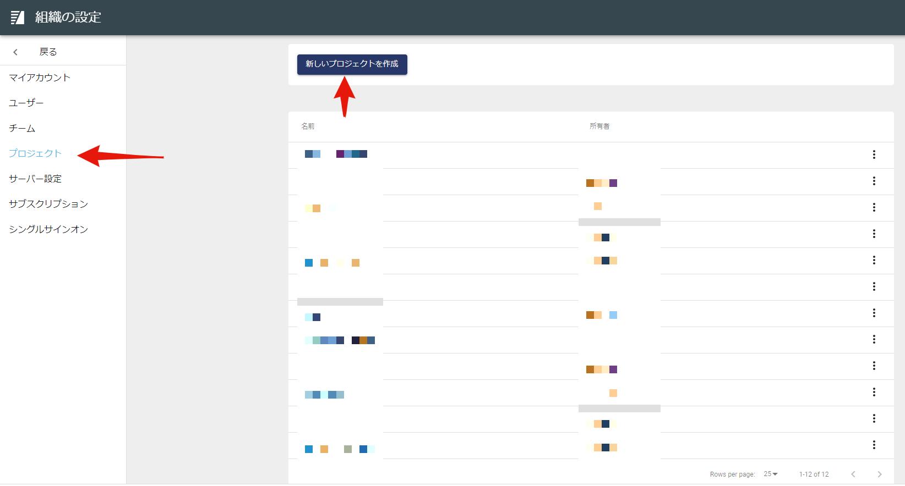
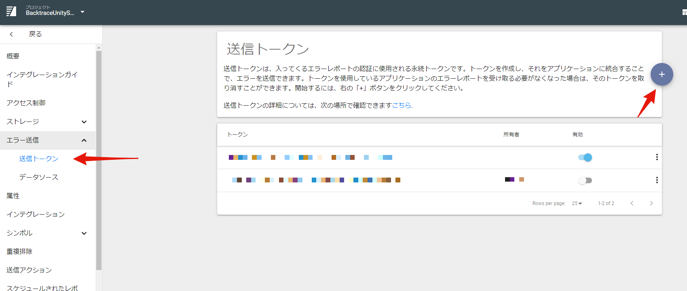
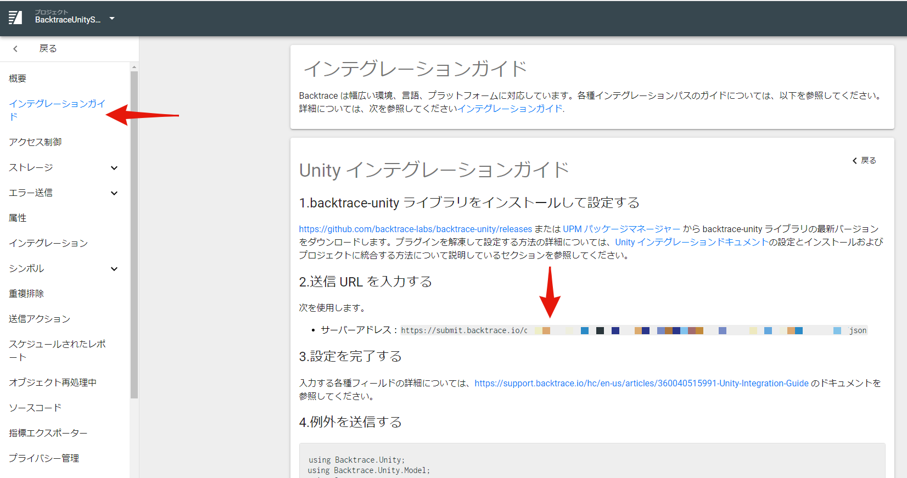
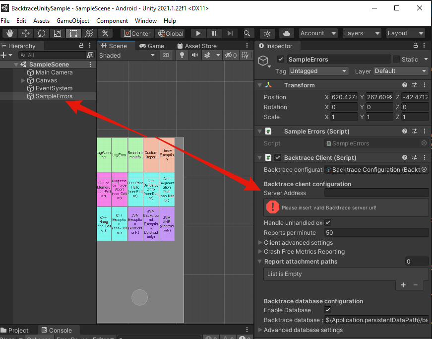

# Backtrace Unity Sample Project

This sample project for [Backtrace](http://backtrace.io/)'s integration with Unity showcases some of the basic features available in Backtrace:

Types of reports
- Managed(C#)
- Native (CPP/Java)
- ANRs/Hangs
- Memory (OOM)

Backtrace features
- Breadcrumbs
- Attachments
- Linking source code

This project has been tested on Unity 2021.1.22f1 for iOS, Android, and Windows (IL2CPP, .Net standard 2.0) and it should work for other supported platforms as well.

# Prerequisites

- Unity environment 2021.1.22f1+
- Backtrace instance - [Create your own](https://forpro.unity3d.jp/unity_pro_tips/2021/10/01/2603/#i) at https://create.unity3d.com/jp-backtrace-trial
- (optional) One of Android / iOS / Windows [modules](https://docs.unity3d.com/Manual/GettingStartedAddingEditorComponents.html) to see various native crashes on each platform

# Getting started

- Set up a new project in your Backtrace instance.
  
- Create a token for the project project.

- In your Backtrace web console project settings go to Integration->Unity and copy the URL of the server.

- Clone this repo and open the "Scenes->SampleScene.unity" scene in Unity.
- In the "Backtrace Client" component of the "Sample Errors" game object, enter the URL of your Backtrace instance in the "Server Address" field.
  

The URL should look something like this:

```csharp

https://submit.backtrace.io/[instance name]/[token string]/json
```

- Press "play" and click the buttons to see the various errors.
- Open your Backtrace web console and confirm the reports are appearing.
  
- Build (File->Build Settings...->Build) in Android / iOS / Windows platforms to test native errors.
- (optional) If you want to see the symbolicated errors for native crashes, follow the steps in the [readme file](https://github.com/backtrace-labs/backtrace-unity/blob/master/README.md).
- (optional) If you want to see the source code in the Backtrace web console, follow the steps in the [support guide](https://support.backtrace.io/hc/en-us/articles/360048398592-Project-Settings-Source-Code).

# Custom webhooks

Below are some example custom Webhook integrations using Python with Docker. More information on setting up custom webhooks is available [here](https://support.backtrace.io/hc/en-us/articles/360040516551-Webhook-Integration):
- [Redmine](./Documentation~/webhook-examples/redmine.zip)
- [Chatwork](./Documentation~/webhook-examples/chatwork.zip)

# Further reading

- Please read the [Backtrace Unity readme file](https://github.com/backtrace-labs/backtrace-unity/blob/master/README.md) for details on how to use Backtrace with Unity.
- Consult the [FAQ](https://forpro.unity3d.jp/unity_pro_tips/2021/11/11/2893/) if you have further questions.
- If you still have questions or would like more information / get a demo, please [contact us](https://create.unity3d.com/jp-sales-contact).
