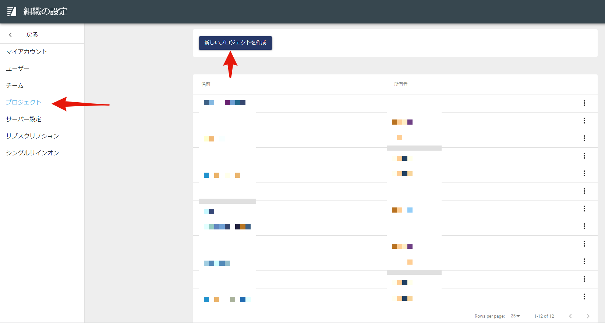
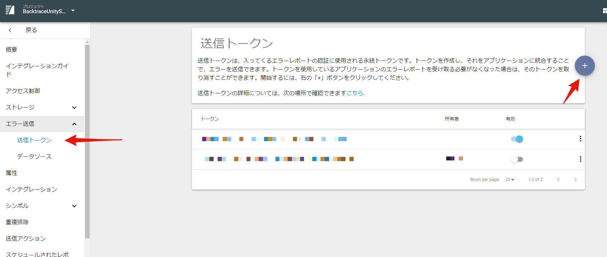
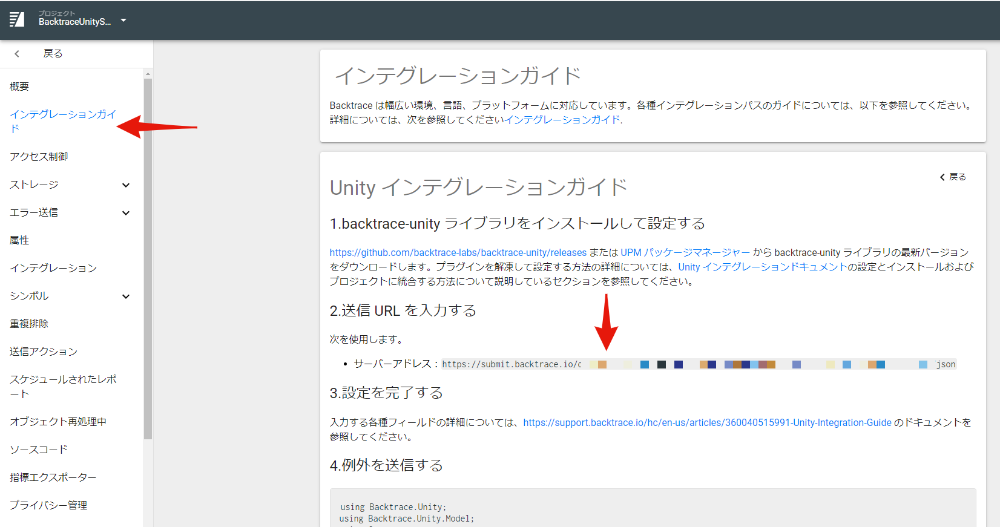
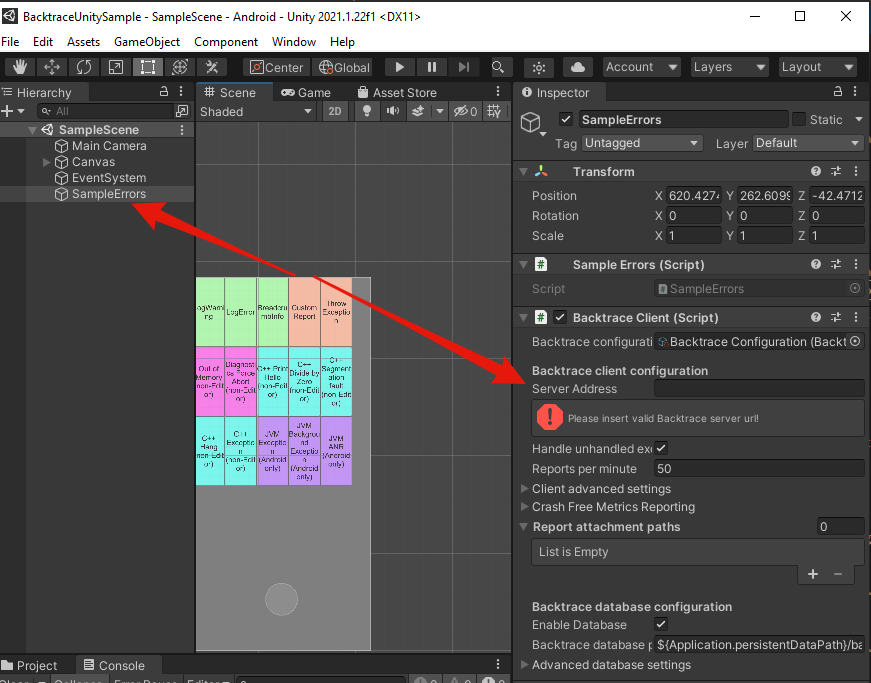
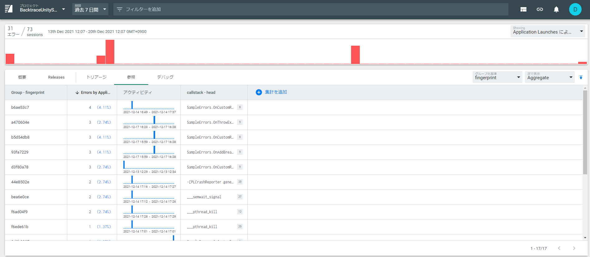

# Backtrace Unityサンプルプロジェクト

[Backtrace](http://backtrace.io/)をUnityに統合する場合の基本的な機能をいくつか紹介するサンプルプロジェクトです。

レポートの種類
- マネージド(C#)
- ネイティブ (CPP/Java)
- ANR、ハング
- メモリ不足によるクラッシュ(OOM)

Backtraceの機能
- パンくず機能
- 添付ファイル
- ソースコードリポジトリとの統合

# 前提条件

- Unity 2021.1.22f1以上
- Backtrace インスタンス - https://create.unity3d.com/jp-backtrace-trial で自分のインスタンスを[作成](https://forpro.unity3d.jp/unity_pro_tips/2021/10/01/2603/#i)
- (任意) Android/iOS/Windows[モジュール](https://docs.unity3d.com/Manual/GettingStartedAddingEditorComponents.html)のうちの1つ以上をインストール

# はじめに

- Backtraceインスタンスに新しいプロジェクトをセットアップします。
  
- 送信トークンを作成します。

- Backtrace ウェブ・コンソールのプロジェクト設定で インテグレーションガイド->Unityに移動し、サーバーの URL をコピーします。

- レポジトリをクローンし、Unity で "Scenes->SampleScene.unity" のシーンを開きます。
- Sample Errors"ゲームオブジェクトの"Backtrace Client" コンポーネントで、"Server Address" フィールドに サーバーの URL を入力します。


```csharp

https://submit.backtrace.io/[instance name]/[token string]/json
```

- プレイボタンを押して、ゲームウインドウのボタンをクリックし、様々なエラーを起こします。
- Backtrace ウェブ・コンソールを開き、レポートが表示されることを確認します。

- Android / iOS / Windows プラットフォームでビルド (File->Build Settings...->Build) して、ネイティブ・エラーをテストします。
- (任意) ネイティブクラッシュのシンボル化されたエラーを確認したい場合は、[Readmeファイル](https://github.com/backtrace-labs/backtrace-unity/blob/master/README.md)の手順に従ってください。
- (任意) Backtrace ウェブコンソール内でソースコードを統合させたい場合は、[サポートガイド](https://support.backtrace.io/hc/en-us/articles/360048398592-Project-Settings-Source-Code)の手順に従ってください。

# カスタムのwebhook

以下は、PythonとDockerを使用したカスタムWebhook統合の例です。カスタムWebhookのセットアップに関する詳細は、[こちら](https://support.backtrace.io/hc/en-us/articles/360040516551-Webhook-Integration)をご覧ください。
- [Redmine](./Documentation~/webhook-examples/redmine.zip)
- [Chatwork](./Documentation~/webhook-examples/chatwork.zip)

# 参考資料

- UnityでのBacktraceの使用方法については、[Readmeファイル](https://github.com/backtrace-labs/backtrace-unity/blob/master/README.md)をお読みください。
- さらに質問がある場合は、[FAQ](https://forpro.unity3d.jp/unity_pro_tips/2021/11/11/2893/) を参照してください。
- ご不明な点がある場合、または詳細な情報やデモをご希望の場合は、[お問い合わせ](https://create.unity3d.com/jp-sales-contact)ください。
